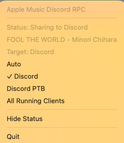

# Apple Music Discord Rich Presence

Show what you're listening to on Apple Music as your Discord status — macOS only.


## Features

- Displays song name, artist, album, and progress
- "Search on Apple Music" button for others to find the track
- Paused state with frozen progress
- Auto-clears after 5 minutes of inactivity
- Auto-reconnects when Discord restarts
- Session timer shows how long you've been listening
- Menu bar icon with status and hide/share toggle
- Auto-start on login via macOS LaunchAgent
- Restarts itself when a Python upgrade breaks its Apple Events permission

## Setup

### 1. Create a Discord Application

1. Go to [Discord Developer Portal](https://discord.com/developers/applications)
2. Click **New Application** — name it whatever you want (this shows as the activity title)
3. Copy the **Application ID** (this is your Client ID)
4. Go to **Rich Presence > Art Assets** and upload images:
   - `apple_music` — large icon (e.g. Apple Music logo)
   - `playing` — small icon for playing state
   - `paused` — small icon for paused state

### 2. Install

```bash
git clone https://github.com/40960/apple-music-discord-rpc.git
cd apple-music-discord-rpc
./install.sh YOUR_CLIENT_ID
```

This will:
- Create a Python virtual environment and install dependencies
- Register a macOS LaunchAgent for auto-start on login
- Start the app immediately

A music-note icon will appear in your menu bar.


### Uninstall

```bash
./uninstall.sh
```

### Manual Run (no auto-start)

```bash
pip install -r requirements.txt
export DISCORD_CLIENT_ID="your_id"
python apple_music_discord.py
```

Use `--no-gui` for terminal-only mode (no menu bar icon).

### Environment Variables

| Variable | Required | Default | Description |
|----------|----------|---------|-------------|
| `DISCORD_CLIENT_ID` | Yes | — | Your Discord Application ID |
| `DISCORD_TARGET` | No | `auto` | Which Discord client to use: `auto`, `stable`, `ptb`, `canary`, or `all` |
| `IDLE_TIMEOUT` | No | `300` | Seconds before clearing status when paused |

`install.sh` bakes `DISCORD_TARGET` and `IDLE_TIMEOUT` into the LaunchAgent when
they are set in the installing shell:

```bash
DISCORD_TARGET=canary IDLE_TIMEOUT=60 ./install.sh YOUR_CLIENT_ID
```

## Menu Bar

| Icon | State |
|------|-------|
| `music.note` | Sharing / Idle |
| `pause.fill` | Paused |
| `eye.slash.fill` | Hidden (status not shared) |
| `exclamationmark.triangle.fill` | Error / Reconnecting |

The icons are SF Symbols, so they follow the menu bar's light/dark appearance.

Click the icon to see current track, status, and toggle visibility.

If multiple Discord clients are running, the menu shows target choices for the
clients it can detect. `Auto` prefers the stable Discord app, then PTB, then
Canary. `All Running Clients` shares the same activity to every detected
Discord client.

The app detects Discord by inspecting the running `discord-ipc-*` sockets. It
supports the normal system Applications folder and the per-user Applications
folder:

- `/Applications/Discord.app`
- `~/Applications/Discord.app`
- `/Applications/Discord PTB.app`
- `~/Applications/Discord PTB.app`
- Canary in the same locations

If you move Discord between folders while this app is running, restart this app
so it can rebuild the detected client list.

## How It Works

Uses AppleScript to poll Apple Music every 5 seconds, then pushes the track info to Discord via Rich Presence ([pypresence](https://github.com/qwertyquerty/pypresence)). Auto-start is handled by a standard macOS [LaunchAgent](https://developer.apple.com/library/archive/documentation/MacOSX/Conceptual/BPSystemStartup/Chapters/CreatingLaunchdJobs.html) plist.

### Surviving a Python upgrade

macOS resolves a process's executable path every time it checks an Apple Events
permission. Homebrew deletes the old `Cellar` directory when it upgrades
`python@3.12`, and a process started before the upgrade keeps executing the now
deleted file. macOS can no longer resolve its path, so it cannot build a TCC
attribution chain and Music rejects every Apple Event with
`errAEEventNotPermitted`:

```
tccd:  proc_pidpath_audittoken() failed from PID[…]: (#2) No such file or directory
tccd:  ERROR: failed to construct a process for the responsible audit token
Music: No designated requirement for process […], so denying this event
```

Nothing crashes — `osascript` just exits non-zero, so the app looks connected
while reporting no track at all.

Each tick calls `proc_pidpath` on its own pid, the same lookup TCC performs. If
the executable is gone the app logs it, exits non-zero, and the LaunchAgent's
`KeepAlive` respawns it against the current interpreter. The replacement process
has a valid path, so the condition cannot repeat and there is no restart loop.

## Troubleshooting

Logs are at `~/Library/Logs/apple-music-discord-rpc.log`.

| Menu bar status | Meaning |
|-----------------|---------|
| `Waiting for Discord...` | Discord is not running, or no `discord-ipc-*` socket was found |
| `Music unavailable: …` | `osascript` failed; the message is the raw AppleScript error |
| `Restarting...` | The interpreter was replaced on disk; launchd is respawning the app |
| `Invalid Client ID` | `DISCORD_CLIENT_ID` is not a real Discord application ID |

If `Music unavailable:` mentions **Not authorized to send Apple events**, grant
the permission under System Settings → Privacy & Security → Automation.

## Development

```bash
./venv/bin/python3 -m unittest discover -p 'test_*.py' -v
```

## Requirements

- macOS (uses AppleScript to talk to Apple Music)
- Python 3.8+
- Discord desktop app
- Apple Music app (not the web player)

## License

AGPL-3.0
